# Ghou.st for the micro:bit

Here is a video of the <a href="https://github.com/Ghoust-game">original</a> <a href="http://ghou.st/">Ghou.st</a> game.

<a href="http://www.youtube.com/watch?feature=player_embedded&v=35liQTgUH04
" target="_blank"></a>

## Get started
- Open https://makecode.microbit.org/
- Connect the micro:bit via USB
- Save file to "USB Drive"


## Blocks
All of the following blocks are required to make it work.

### On start
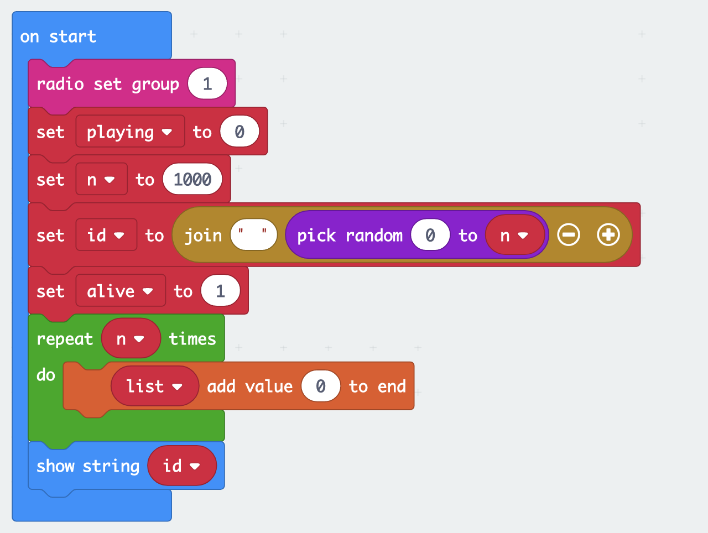

### Forever
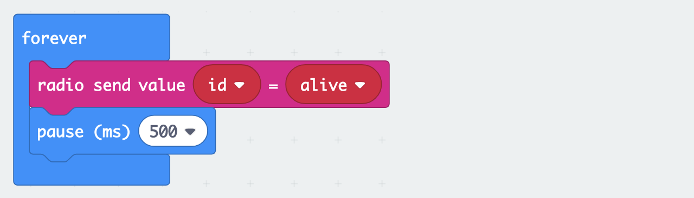

### On radio
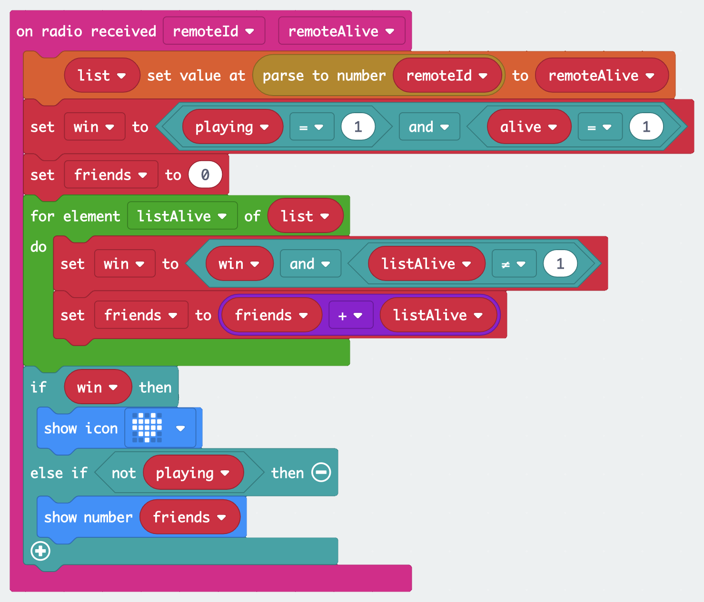

### On button
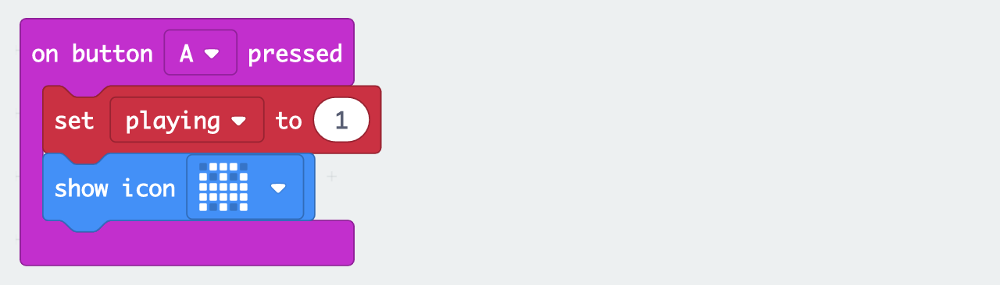

### On shake
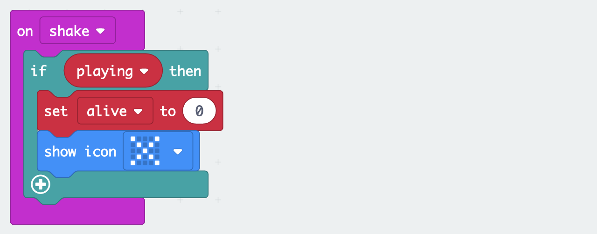

## Code
```
input.onButtonPressed(Button.A, function () {
    playing = 1
    basic.showIcon(IconNames.Ghost)
})
radio.onReceivedValueDeprecated(function (remoteId, remoteAlive) {
    list[parseFloat(remoteId)] = remoteAlive
    win = playing == 1 && alive == 1
    friends = 0
    for (let listAlive of list) {
        win = win && listAlive != 1
        friends = friends + listAlive
    }
    if (win) {
        basic.showIcon(IconNames.Heart)
    } else if (!(playing)) {
        basic.showNumber(friends + 1)
    }
})
input.onGesture(Gesture.Shake, function () {
    if (playing) {
        alive = 0
        basic.showIcon(IconNames.No)
    }
})
let friends = 0
let win = false
let list: number[] = []
let alive = 0
let playing = 0
radio.setGroup(1)
playing = 0
let n = 300
let id = "" + Math.randomRange(0, n)
alive = 1
for (let i = 0; i < n; i++) {
    list.push(0)
}
basic.showString(id)
basic.forever(function () {
    radio.sendValue(id, alive)
    basic.pause(500)
})
```

## How to play
- Use one micro:bit per player flashed with the above <a href="#code">code</a>.
- Reset your micro:bit to display the device ID and watch it start counting.
- Wait until all players see the same number which should equal the total number of players.
- Once everybody is ready, press the A button to become a ghoust, then try to shake other players' devices.

## How it works
<a href="#code">The code</a> implements a simple, distributed algorithm, without a central coordinator :)

### Getting a "unique" device ID
<a href="#on-start">On start</a> your device picks a random _id_ between 0 and _n_ (e.g. n = 300, n >> number of devices).

### Broadcasting your ID and status
<a href="#forever">Forever</a>, your device broadcasts (via Bluetooth radio) its _id_ and _alive_ status which is either 1 (alive) or 0 (not alive).

### Keeping track of other devices
<a href="#on-radio">On radio</a>, if a broadcast message was received, your device reads the remote device's _id_ and _alive_ status and updates its list.

### Detecting that you're out
<a href="#on-shake">On shake</a>, the device knows immediately, that it is no longer alive. All others learn it eventually, via broadcast.

### Detecting that you win
A device knows it won, if it's alive, and all other devices in its list are not alive.

## Make an enclosure

### Cut a PET bottle
Pierce a hole and cut along the label.


Cut off the bottom part of the bottle.


Then make a short, vertical cut as shown.

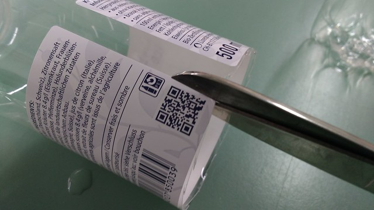

### Use a laser-cut adapter
Here's a <a href="designs/ghoust-chaya.dxf">design</a> to fit the micro:bit into Chaya bottles.

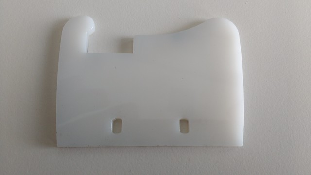

Connect the wires, align the adapter with the battery plug.

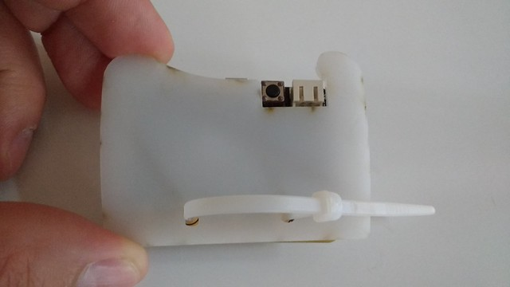

Loosely strap the micro:bit to the adapter with a zip tie.

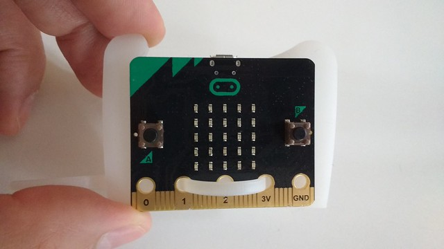

Apply hot glue to both sides and place the battery.

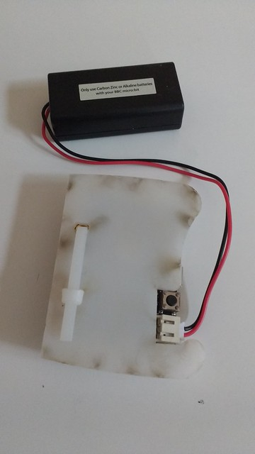&nbsp;&nbsp;&nbsp;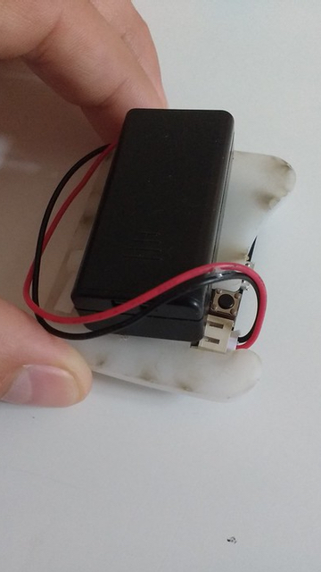

### Add a button and a buzzer
Pierce small holes in the bottle cap to add a button and a buzzer.

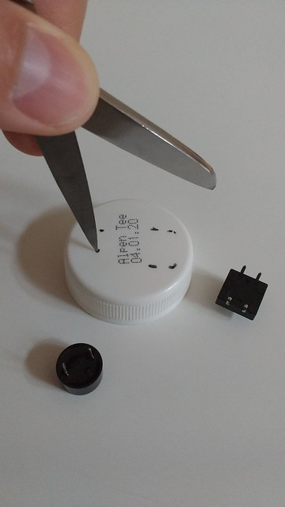&nbsp;&nbsp;&nbsp;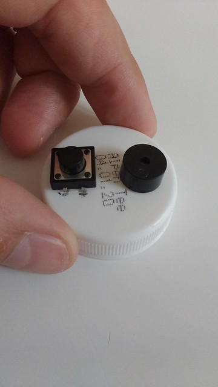

Cut two crocodile clip wires in half and remove the insulation.

&nbsp;&nbsp;&nbsp;

Solder the wires to the pins - take care not to melt the cap.

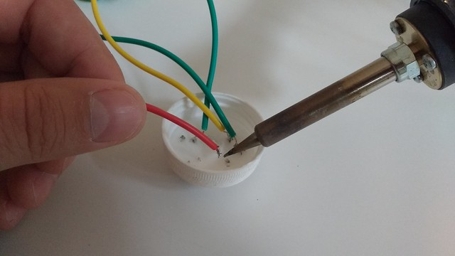

Put the wires through the bottle, and connect them to the micro:bit.

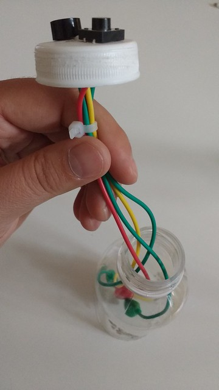&nbsp;&nbsp;&nbsp;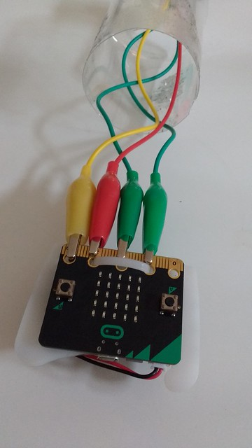

Make sure the wires are connected right, run some test code to verify.

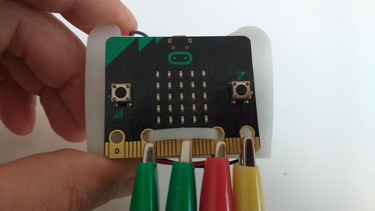&nbsp;&nbsp;&nbsp;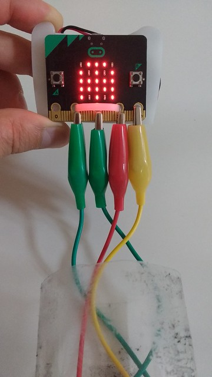

### Add code for the button
In addition to <a href="#code">the code</a> above, add the following block.

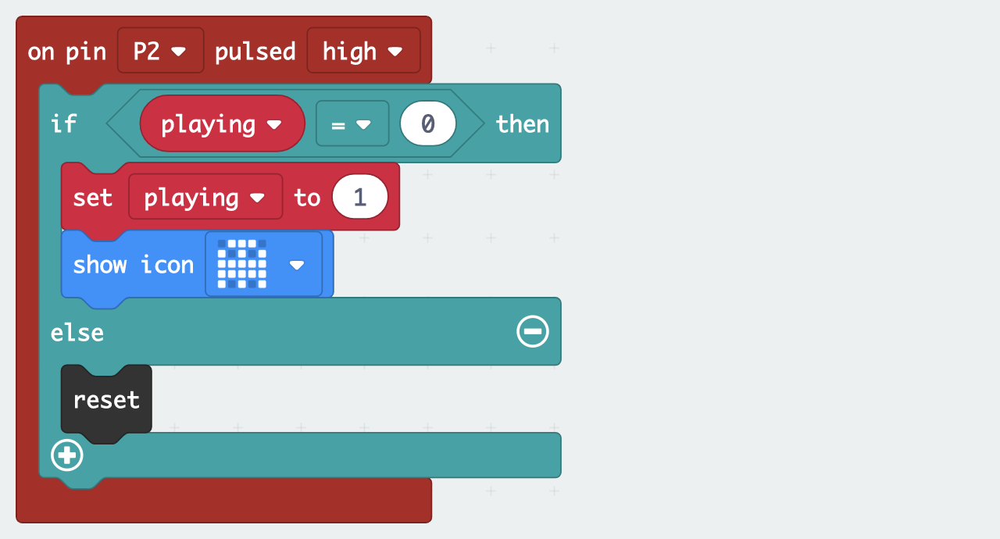

```
pins.onPulsed(DigitalPin.P2, PulseValue.High, function () {
    if (playing == 0) {
        playing = 1
        basic.showIcon(IconNames.Ghost)
    } else { // playing == 1
        control.reset() // sets playing to 0
    }
})
```

### Add code for the buzzer
TODO

### Switch on the micro:bit and start playing
Switch it on, then squeeze the top to add the micro:bit and re-assemble the bottle.

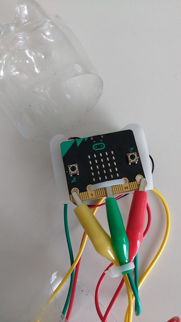&nbsp;&nbsp;&nbsp;

That's it! You are ready <a href="#how-to-play">to play</a>.

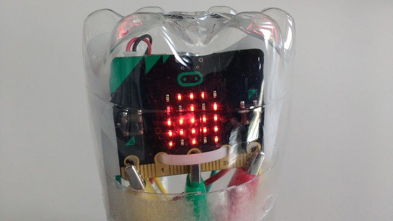
